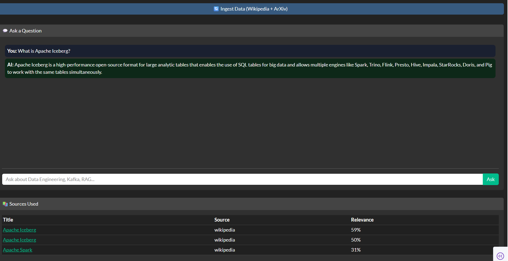

# AI-Powered Data Pipeline

End-to-end RAG pipeline combining Data Engineering with AI.

## Architecture

\
Data Sources (Wikipedia, ArXiv, PDFs)

        ↓

Ingestion Pipeline (Python)

        ↓

Text Chunking + Embeddings (HuggingFace)

        ↓

ChromaDB (Vector Database)

        ↓

LangChain RAG Pipeline

        ↓

Ollama + Llama 3.2 3B (Local LLM - Free)

        ↓

FastAPI (REST API)

        ↓

Plotly Dash (Chat Dashboard)

## Dashboard Screenshot

### Features
- 💬 Chat interface to ask questions
- 🤖 AI answers powered by Llama 3.2 3B (local, free)
- 📚 Sources shown with relevance percentage
- 🔄 One-click data ingestion (Wikipedia + ArXiv)
- 📊 Vector DB stats (chunks stored)

\
## Tech Stack

| Layer | Technology | Cost |

|-------|-----------|------|

| LLM | Ollama + Llama 3.2 3B | Free (local) |

| Vector DB | ChromaDB | Free (local) |

| Embeddings | HuggingFace Sentence Transformers | Free |

| AI Framework | LangChain | Free |

| Data Sources | Wikipedia API + ArXiv | Free |

| Storage | AWS S3 | Free tier |

| API | FastAPI | Free |

| Dashboard | Plotly Dash | Free |

## Why This Project?

Enterprise data pipelines increasingly require AI capabilities

to extract insights from unstructured data at scale.

This project demonstrates:

- Building production-grade RAG systems on top of data pipelines

- Handling unstructured data (documents, PDFs, research papers)

- Combining vector search with traditional data engineering

- Deploying local LLMs for secure, cost-effective AI inference

- Designing scalable document ingestion and retrieval architectures

Real-world use cases this solves:

- Internal knowledge base search for large organizations

- Automated research paper analysis and summarization

- Document Q&A systems for enterprise data teams

- Intelligent data catalog with natural language querying

## Setup

### Prerequisites

- Python 3.13

- Docker Desktop

- 8GB+ RAM

### Run Locally

\
1. Start containers

   docker start ollama chromadb

2. Install dependencies

   pip install -r requirements.txt

3. Ingest data

   python ingestion/wikipedia_ingestion.py

4. Run API

   uvicorn api.main:app --reload

5. Run dashboard

   python dashboard/app.py

\
## Author

Saikrishna - Senior Data Engineer, Tampa FL

